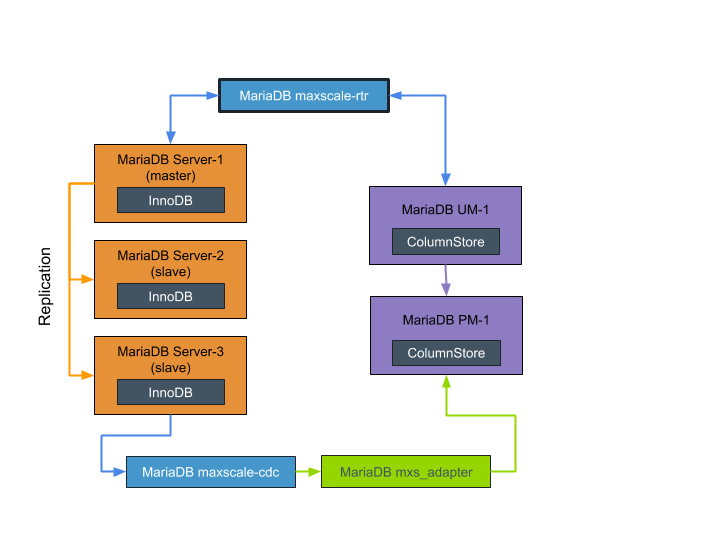

# MariaDB Platform Single Container Image
## Overview

This project combines all of the elements of MariaDB platform into a single container.  This provides an easy way to get your familiar with the many parts of Platform without having to manually setup and configure the various components. This single container image is intended for test and development environments and should **not be used for production deployments**.

Note: Packing multiple processes and services into a single container runs somewhat counter to the principles of containerizing software, but this approach provides a convenient mechanism for delivering all the components of MariaDB platform.

## Instructions


### Download
You have a couple options for downloading and running the MariaDB Platform Single Container Image.

#### Docker command line via Docker Hub
Provided your local docker environment is configured to pull from Docker Hub

`docker pull mariadb/platform_single:latest`

#### Clone github Repository and build Image

`git clone git@github.com:mariadb-corporation/mariadb-platform-docker.git`

`cd mariadb-platform-docker/single-container`

`docker build . -t mariadb/platform_single:latest`

### Running Image

`docker run --name mariadb-platform mariadb/platform_single:latest`

While it is possible to expose Maxsacle RTR to your host machine and issue SQL to the image, opening a shell prompt on the image will allow you explore MariaDB Platform.  You will also use this shell access to reconfigure components as required for your testing.

`docker exec -it mariadb-platform /bin/bash`

If you do want to expose the Maxscale RTR port to your host machine, you need to publish the port with the -p flag when running the image.

`docker run -p 3306:33061/tcp --name mariadb-platform mariadb/platform_single:latest`

### Architecture
The image has been setup to allow testing of hybrid transactional analytical processing (HTAP), and the basic components are outlines in [this](https://mariadb.com/kb/en/library/sample-platform-x3-implementation-for-transactional-and-analytical-workloads/) knowledgebase article. The major differences include running a three member MariaDB Server Master-Slave cluster (instead of four member), and a simple one UM and one PM MariaDB Columnstore setup.  (The image is still big, even having opted for this trimmed down approach).




### Base Image and Utilities
The Platform Single Container Image sources its base image from the [Columnstore Single Node](https://github.com/mariadb-corporation/mariadb-columnstore-docker/tree/master/columnstore) docker image.  This means that it based on Centos 7, and has installed the runit utility for init and service supervision.

You can find all of the service definitions at `/ect/service` For example `/ect/service/mariadb-maxscale-rtr/run` show the startup command for the Maxscale router service. Importantly, this shows that the Maxscale router service reads a configuration file located at `/etc/mariadb-maxscale-rtr.cnf`

Stopping and starting the services is done with standard runit commands.

```
sv down mariadb-maxscale-rtr
sv up mariadb-maxscale-rtr
sv restart mariadb-maxscale-rtr
```

Between inspecting services, editing config files, and restarting services, you have the means to reconfigure MariaDB Platform to match your requirements.

### MariaDB Columnstore

| Item | Value |
| --- | --- |
| O/S user | `root` |
| Install location | `/usr/local/mariadb/columnstore` |
| Service definition | `/etc/service/columnstore` |
| Config file | `/usr/local/mariadb/columnstore/mysql` |
| Log file directory | `/var/log/mariadb/columnstore` |

### MariaDB Server Master/Slave

| Item | Value |
| --- | --- |
| O/S user | `mysql2` |
| Install location | `/usr/local/mysql/` |
| Service definitions | `/etc/service/mariadb-server-1  /etc/service/mariadb-server-2  /etc/service/mariadb-server-3`  |
| Config files | `/etc/mariadb-server-1.cnf  mariadb-server-2.cnf  mariadb-server-3.cnf` |
| Log files | `/var/log/mysqld1.log  /var/log/mysqld2.log  /var/log/mysqld3.log` |

### MariaDB Maxscale Router

| Item | Value |
| --- | --- |
| O/S user | `maxscale` |
| Install location | `/usr/bin` |
| Service definition | `/etc/service/mariadb-maxscale-rtr` |
| Config file | `/etc/mariadb-maxscale-rtr.cnf` |
| Log file(s) | `/var/log/maxscale/maxscale.log` |

### MariaDB Maxscale CDC

| Item | Value |
| --- | --- |
| O/S user | `maxscale` |
| Install location | `/usr/bin` |
| Service definition | `/etc/service/mariadb-maxscale-cdc` |
| Config file | `/etc/mariadb-maxscale-cdc.cnf` |
| Log file(s) | `/var/log/maxscale-cdc/maxscale.log` |

### MariaDB MXS Adapter

| Item | Value |
| --- | --- |
| O/S user | `root` |
| Install location | `/usr/bin` |
| Service definition | not service enabled |
| Config file | per run |
| Log file(s) | per run |

The MXS adpater is responsible for moving data from the AVRO files into Columnstore.  It is not configured to run as a service because the exact configurtion (schema, table, etc...) will depend on your use case.  For example, to stream data from the t6 table in the test schema, you can launch the following command.

`mxs_adapter -c /usr/local/mariadb/columnstore/etc/Columnstore.xml -u cdcuser -p cdcpwd -h 127.0.0.1 -P 4001 -r 2 -d -n -z test t6`

## Connecting to Services
With many service runnign inside this single image, it is easy to accidentally connect to the wrong service.  When connecting from within the image, be sure to connect using the host 127.0.0.1, and the appropriate port number.

For example, if you want to connect directly to the master using the mysql client:

`mysql --host=127.0.0.1 -P 33061`

Forgetting the host option will end up ignoring the Port option and will connect to the Columnstore UM which has established a socket at the standard location:

`mysql -P 33061`

You can see from the initial message from mysql that you are connected to Columnstore:

```
Welcome to the MariaDB monitor.  Commands end with ; or \g.
Your MariaDB connection id is 19
Server version: 10.3.11-MariaDB-log Columnstore 1.2.2-1

Copyright (c) 2000, 2018, Oracle, MariaDB Corporation Ab and others.

Type 'help;' or '\h' for help. Type '\c' to clear the current input statement.
```

Of course, most connections should be to the maxscale router process:

`mysql --host=127.0.0.1 -P 3306 --user=maxuser --password='maxpwd'`

## Issues, Comments and Suggestions

Please use the github issue feature to provide any and all feedback.

## Errata and Future Enhancements

## Release History

- X3-1.0 Initial release
- x3-1.1 Fixes to avro router configuration and Columnstore.xml for MXS Adapter
